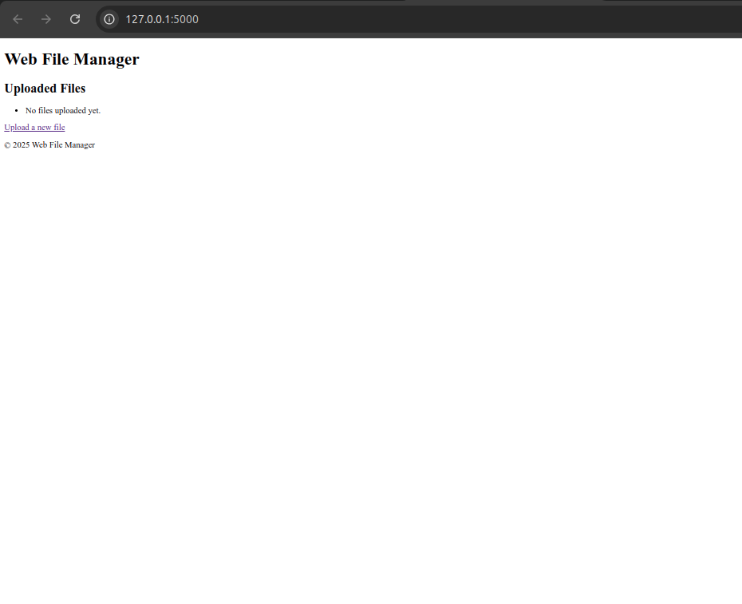
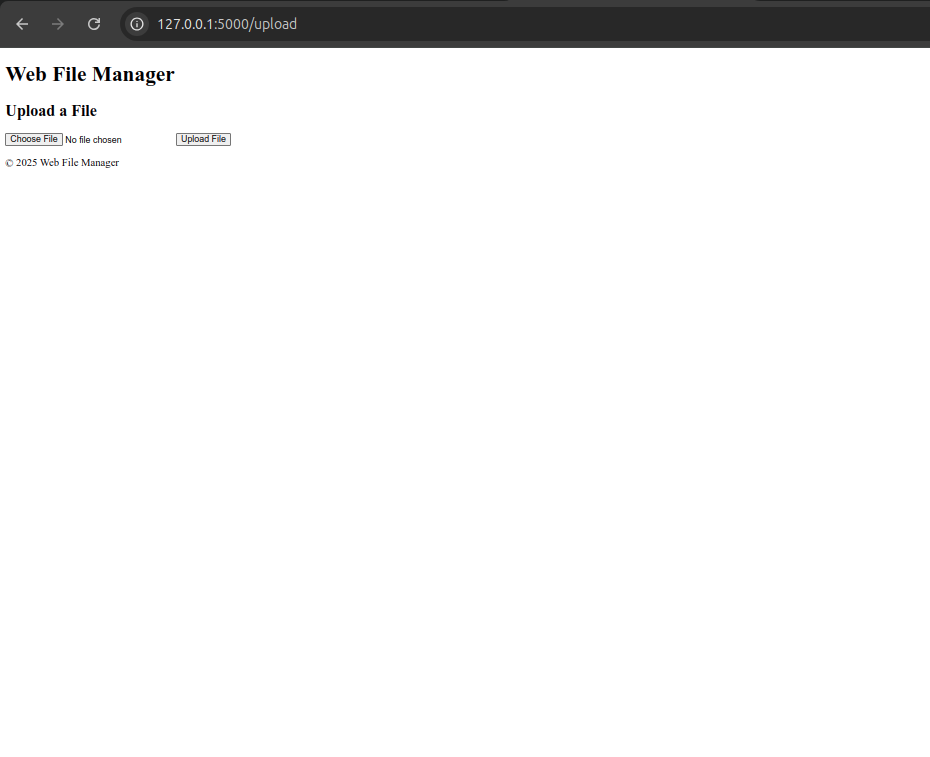

# Web File Manager

A lightweight, web-based file manager built with Flask. This application allows users to upload, download, and manage files through a simple and intuitive web interface. It is designed for local network use and can be easily extended for more advanced use cases.

---

## Features

- **File Uploads**: Upload files to the server with a size limit of 16MB.
- **File Downloads**: Securely download files from the server.
- **Error Handling**: Custom 404 error page for missing files.
- **Lightweight**: Minimal dependencies for easy setup and deployment.
- **Dynamic File Listing**: Automatically lists all uploaded files on the home page.

---

## Screenshots

### Home Page
Displays a list of uploaded files with download links.



### Upload Page
Allows users to upload files to the server.



---

## Installation

### Prerequisites
- Python 3.7 or higher
- `pip` (Python package manager)

### Steps
1. Clone the repository:
   ```bash
   git clone https://github.com/hiddent3erminal/Web-File-Manager.git
   cd Web-File-Manager
   ```

2. Install dependencies:
   ```bash
   pip install -r requirements.txt
   ```

3. Run the application:
   ```bash
   python3 app.py
   ```

4. Open your browser and go to `http://127.0.0.1:5000`.

---

## Usage

### Uploading Files
1. Navigate to the "Upload" page.
2. Select a file using the file input field.
3. Click the "Upload File" button to upload the file to the server.

### Downloading Files
1. On the home page, click on the file name to download it.

---

## Project Structure

```
Web-File-Manager/
├── app.py                 # Main Flask application
├── requirements.txt       # Python dependencies
├── templates/             # HTML templates
│   ├── base.html          # Base layout for all pages
│   ├── index.html         # Home page template
│   ├── upload.html        # Upload page template
│   └── 404.html           # Custom 404 error page
├── uploads/               # Directory for uploaded files (created at runtime)
├── README.md              # Project documentation
└── LICENSE                # License file
```

---

## Limitations
- The application is designed for local use and is not production-ready.
- File size is limited to 16MB by default (can be configured in `app.py`).

---

## Future Improvements
- Add user authentication for secure file access.
- Implement file deletion functionality.
- Enhance the UI with a modern CSS framework (e.g., Bootstrap or Tailwind CSS).
- Add support for file previews (e.g., images, PDFs).
- Add logging for better monitoring and debugging.

---

## License
This project is licensed under the MIT License.

---

## Contributing
Contributions are welcome! Please follow these steps:
1. Fork the repository.
2. Create a new branch for your feature or bug fix.
3. Commit your changes and push them to your fork.
4. Submit a pull request.
